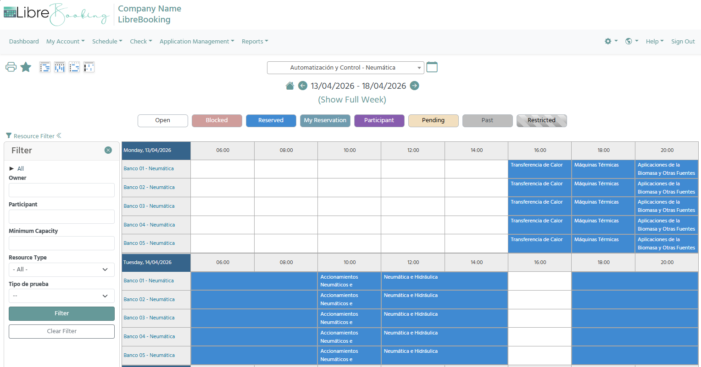
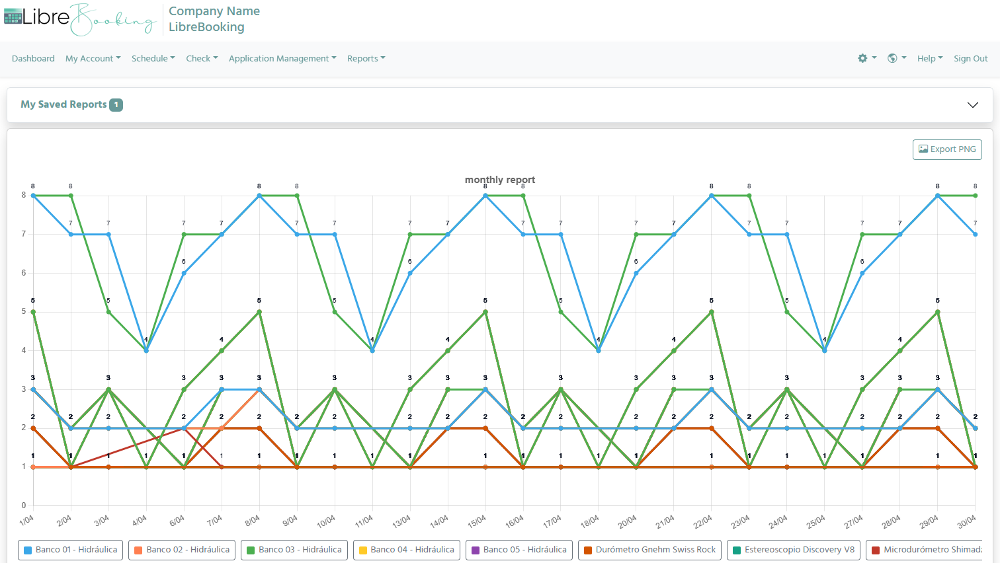

# Librebooking

[](https://github.com/LibreBooking/app/issues)
[](https://github.com/LibreBooking/app/commits)
[](https://github.com/LibreBooking/app/releases)
[](./LICENSE.md)

[](https://github.com/LibreBooking/app/stargazers)
[](https://github.com/LibreBooking/app/network)

[](https://www.php.net/)
[](https://www.mysql.com/)


[](https://github.com/LibreBooking/docker)
[](https://github.com/LibreBooking/docker)

[](https://discord.gg/4TGThPtmX8)
[](https://github.com/LibreBooking/app/wiki)

⭐ Star us on GitHub — it motivates us a lot!

🔥 Join the community: [Discord discussion channel](https://discord.gg/4TGThPtmX8) .

## Table of Contents

- [About](#-about)
- [Features](#-features)
- [Screenshots](#-screenshots)
- [Installation & Deployment](#-installation--deployment)
- [Developer Documentation](#-developer-documentation)
- [Configuration & Theming](#-configuration--theming)
- [ReCaptcha](#-recaptcha)
- [Community & Support](#-community--support)
- [Contributing](#-contributing)
- [Roadmap](#-roadmap)
- [License](#-license)

## 🚀 About

**LibreBooking** is an open-source scheduling solution, forked from Booked Scheduler. It offers a flexible, mobile-friendly, and extensible interface for organizations to manage resource reservations. The repository for the last open source version of Booked Scheduler is maintained here; the `develop` branch contains the latest working code (beta), while `master` is the stable release.

## ✨ Features

- [x] Multi-resource booking & waitlists
- [x] DataTables for advanced listings
- [x] Role-based access control
- [x] Quotas and credits for reservations
- [x] Granular usage reporting
- [x] Responsive Bootstrap 5 interface
- [x] Custom themes and color schemes
- [x] Plugin-ready architecture
- [x] Outlook/Thunderbird integration through ics

## 📸 Screenshots







## 🔧 Installation & Deployment

### Manual Installation

For full setup instructions, see [INSTALLATION.md](./doc/INSTALLATION.md)

### Docker Deployment

LibreBooking is available as a Docker container. See [LibreBooking Docker README](https://github.com/LibreBooking/docker) for complete setup.

```bash
git clone https://github.com/LibreBooking/docker.git
cd docker
docker-compose up -d
```

## 💻 Developer Documentation

- See [doc/README.md](./doc/README.md) for developer notes.
- See [doc/API.md](./doc/API.md) for API notes.
- See [doc/Oauth2-Configuration.md](./doc/Oauth2-Configuration.md) for Oauth2 configuration.
- See [doc/SAML-Configuration.md](./doc/SAML-Configuration.md) for SAML configuration.
- Codebase follows PSR-12 standards and GitHub Flow.

## 🎨 Configuration & Theming

- Change theme via `config.php`:

  ```php
  $conf['settings']['css.theme'] = 'default';
  ```

- Theme options: 'default', 'dimgray', 'dark_red', 'dark_green', 'french_blue', 'pastel_blue'
- Customize `Web/css/librebooking.css`.

## 🔒 ReCaptcha

As of 09/03/2023, ReCaptcha integration updated to v3. Generate new keys for your domain if using ReCaptcha.

## 💬 Community & Support

- [Discord](https://discord.gg/4TGThPtmX8)
- [Wiki](https://github.com/LibreBooking/app/wiki)
- [Issues](https://github.com/LibreBooking/app/issues)
- [Discussions](https://github.com/LibreBooking/app/discussions)

## 🤝 Contributing

- Fork, file issues, suggest improvements.
- Even non-coders can help by reporting bugs, testing, updating issues.
- PRs welcome (docs, features, refactoring, fixes).
- See CONTRIBUTING.md if present.

## 💡 Roadmap

_Work in progress – roadmap to be defined._  
Want to suggest a feature? [Open an issue](https://github.com/LibreBooking/app/issues) or join the [Discord discussion channel](https://discord.gg/4TGThPtmX8).

## 📜 License

This project is licensed under **GPL-3.0**.

## 🙏 Acknowledgments

Forked from Booked Scheduler. Thanks to all contributors and the community.

[Back to top](#librebooking)
